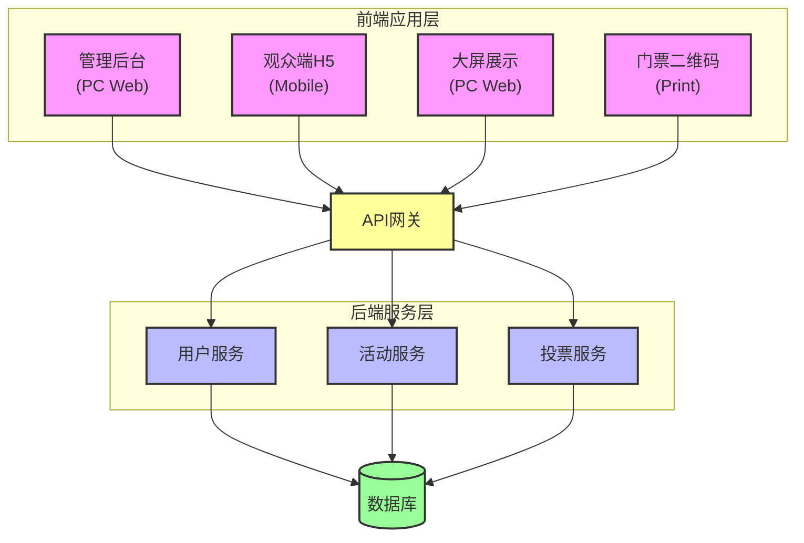

# 辩论活动实时投票互动系统 - 完整项目方案及PRD

## 一、项目概述

### 1.1 项目背景
本项目旨在为辩论活动提供一套完整的实时投票互动解决方案,支持活动组织者高效管理辩论赛事,同时为现场观众提供便捷的投票互动体验,并通过大屏实时展示投票数据,增强活动的参与感和观赏性。

### 1.2 项目目标
- 为活动主办方提供完善的活动管理和协同工具
- 为现场观众提供简单易用的投票互动体验
- 为现场提供实时、可视化的数据展示
- 构建稳定、可扩展的技术架构支撑高并发场景

### 1.3 核心价值
- **主办方价值**:降低活动组织成本,提升活动管理效率,实时掌控现场数据
- **观众价值**:无需注册即可参与,扫码快速进入,实时表达观点
- **活动价值**:增强互动性,提升现场氛围,数据可追溯可分析

---

## 二、产品需求文档 (PRD)

### 2.1 产品架构

#### 2.1.1 系统角色定义

| 角色类型 | 角色名称 | 是否需要账户 | 主要功能 |
|---------|---------|------------|---------|
| 系统管理 | 系统管理员 | 是 | 用户管理、系统配置、数据监控 |
| 活动管理 | 活动主办方 | 是 | 创建活动、管理辩题、邀请协作、查看数据 |
| 活动管理 | 协作管理员 | 是 | 协助管理活动(权限由主办方分配) |
| 活动参与 | 现场观众 | 否 | 扫码/输入编号参与、投票、改票 |
| 数据展示 | 现场大屏 | 否 | 实时展示投票数据和统计图表 |

#### 2.1.2 系统架构

---

### 2.2 功能需求详述

#### 2.2.1 用户管理模块

**F1.1 用户注册与登录**
- **需求描述**:系统管理员和活动主办方需要通过账号登录系统
- **功能点**:
  - 支持邮箱/手机号注册
  - 邮箱/手机验证
  - 密码找回功能
  - 第三方登录(可选:微信、Google)
- **验收标准**:
  - 注册流程≤3步
  - 登录响应时间≤2秒
  - 密码强度校验(8位以上,包含字母数字)

**F1.2 用户权限管理**
- **需求描述**:系统管理员可以管理所有用户
- **功能点**:
  - 查看用户列表
  - 禁用/启用账户
  - 查看用户创建的活动数量
  - 用户行为日志

---

#### 2.2.2 活动管理模块

**F2.1 创建活动**
- **需求描述**:主办方可以创建新的辩论活动
- **必填字段**:
  - 活动名称
  - 活动时间(开始-结束)
  - 活动地点
  - 活动描述
- **选填字段**:
  - 活动封面图
  - 预计参与人数
  - 活动标签
- **系统自动生成**:
  - 活动ID(唯一标识)
  - 活动二维码(用于大屏接入)
  - 创建时间

**F2.2 活动列表与筛选**
- **需求描述**:主办方查看自己创建和参与管理的所有活动
- **功能点**:
  - 我创建的活动
  - 我协作的活动
  - 活动状态筛选(未开始/进行中/已结束)
  - 按时间排序
  - 搜索功能(活动名称/ID)

**F2.3 协作管理**
- **需求描述**:主办方可以邀请其他用户协同管理活动
- **功能点**:
  - 通过邮箱/手机号邀请
  - 设置协作权限:
    - 查看权限(只读)
    - 编辑权限(管理辩题、参与者)
    - 控制权限(切换辩题、控制进度)
  - 移除协作者
  - 协作者列表展示
- **验收标准**:
  - 邀请发送实时通知
  - 权限变更立即生效

**F2.4 参与者管理**
- **需求描述**:批量添加和管理活动参与者
- **功能点**:
  - 手动添加(单个)
  - 批量导入(Excel模板)
  - 参与者信息:
    - 参与者编号(系统生成,6位数字)
    - 姓名(选填)
    - 手机号(选填)
    - 备注(选填)
  - 生成参与者二维码
  - 批量打印门票
  - 参与状态查看(已到场/未到场)
  - 导出参与者数据

**F2.5 活动设置**
- **需求描述**:配置活动的各项参数
- **功能点**:
  - 是否允许中途改票
  - 每个辩题改票次数限制
  - 是否显示实时票数百分比
  - 大屏主题风格选择
  - 活动结束后数据是否公开

---

#### 2.2.3 辩题管理模块

**F3.1 创建辩题**
- **需求描述**:为活动添加辩题
- **必填字段**:
  - 辩题标题
  - 正方观点描述
  - 反方观点描述
- **选填字段**:
  - 辩题背景介绍
  - 预计辩论时长
  - 辩题排序
- **系统自动生成**:
  - 辩题ID
  - 创建时间

**F3.2 辩题列表**
- **需求描述**:展示活动下的所有辩题
- **显示内容**:
  - 辩题标题
  - 当前状态
  - 正反方票数
  - 排序号
  - 操作按钮(编辑/删除/切换)
- **功能点**:
  - 拖拽排序
  - 批量操作
  - 复制辩题(含投票数据/不含投票数据)

**F3.3 辩题状态控制**
- **需求描述**:实时控制辩题的辩论进度
- **四种状态**:
  1. **待开始**: 
     - 参与者可见但不能投票
     - 大屏显示"即将开始"
  2. **辩论中**: 
     - 参与者可以改票
     - 大屏实时展示票数变化
     - 显示改票人数和比例
  3. **最终投票**: 
     - 辩论结束,开启最终投票窗口
     - 参与者可以最后一次改票
     - 大屏突出显示"最终投票进行中"
  4. **已结束**: 
     - 锁定投票结果
     - 展示最终统计数据
     - 生成数据报告

**F3.4 辩题切换**
- **需求描述**:主办方可以在后台切换当前展示的辩题
- **功能点**:
  - 下拉选择切换
  - 快捷键切换(上一个/下一个)
  - 切换预览(切换前确认)
  - 大屏同步更新(延迟≤1秒)

---

#### 2.2.4 投票系统模块

**F4.1 参与者入场**
- **需求描述**:参与者通过门票进入活动
- **入场方式**:
  - 方式1: 扫描门票二维码直接进入
  - 方式2: 手动输入活动ID + 参与者编号
- **入场流程**:
  1. 验证活动ID有效性
  2. 验证参与者编号有效性
  3. 检查是否已入场(防止重复)
  4. 记录入场时间
  5. 跳转到活动投票页面
- **验收标准**:
  - 扫码入场≤2秒
  - 手动输入有清晰的错误提示
  - 已入场用户自动跳转到投票页面

**F4.2 初始投票**
- **需求描述**:辩论开始前参与者进行初始立场投票
- **功能点**:
  - 展示辩题信息(标题、正反方观点)
  - 选择正方/反方/弃权
  - 提交投票
  - 投票后显示"已投票"状态
  - 是否显示当前票数(可配置)
- **交互逻辑**:
  - 未投票:显示投票按钮
  - 已投票:显示投票结果,并提示"辩论开始后可以改票"
  - 点击"查看其他辩题"可浏览所有辩题

**F4.3 实时改票**
- **需求描述**:辩论过程中参与者可以改变立场
- **功能点**:
  - 显示当前投票选项(高亮)
  - 点击其他选项进行改票
  - 改票确认弹窗(防止误操作)
  - 记录改票时间和改票前后选项
  - 显示剩余改票次数(如有限制)
- **改票规则**:
  - 只能在"辩论中"和"最终投票"状态改票
  - 受活动设置的改票次数限制
  - 改票立即生效,大屏同步更新

**F4.4 投票锁定**
- **需求描述**:辩题结束后锁定投票结果
- **功能点**:
  - 状态变为"已结束"后,不可再投票
  - 显示最终投票结果
  - 显示个人投票历史(初始投票→改票记录)
  - 提示"下一辩题即将开始"

---

#### 2.2.5 大屏展示模块

**F5.1 大屏接入**
- **需求描述**: 现场大屏需通过活动主办方或协作管理员账号登录后台（需鉴权），登录后可从后台进入大屏展示页面。
- **接入方式**:
  - 活动主办方/协作管理员账号登录后台，进入大屏展示入口
  - 登录后选择对应活动，点击进入大屏（需鉴权）
  - 也可通过后台生成的大屏专属链接进入（需先登录）
- **接入后**:
  - 全屏显示模式
  - 自动跟随当前辩题
  - 实时数据更新
  - 支持多终端同时接入

**大屏显示类型**:
大屏支持四种显示类型，主办方可在后台切换：
1. 显示当前辩题（仅展示辩题内容及状态）
2. 显示正方支持者情况（仅展示正方票数及相关数据）
3. 显示反方支持者情况（仅展示反方票数及相关数据）
4. 显示正反两方支持者情况（同时展示正反双方票数及对比数据）
  - 各类型均可实时切换，切换后大屏内容即时更新
  - 后台可预览各类型显示效果

**F5.2 数据展示内容**

**初始投票阶段显示**:
- 活动名称和当前辩题
- 辩题状态标识
- 正方票数及百分比
- 反方票数及百分比
- 弃权票数及百分比
- 总投票人数 / 总参与人数
- 投票进度条

**辩论中显示**:
- 以上所有内容
- **新增**:改票人数(从正方转反方、从反方转正方、从弃权转正/反)
- **新增**:改票率(改票人数/总投票人数)
- **新增**:实时票数变化趋势图(折线图)
- **新增**:最近改票动态(滚动显示,仅显示"参与者XXX改变了立场",不显示具体方向)

**最终投票阶段显示**:
- 突出显示"最终投票进行中"
- 倒计时(如设置)
- 高亮显示票数变化

**已结束阶段显示**:
- 最终结果
- 获胜方高亮
- 完整的投票统计数据
- 改票统计分析

**F5.3 大屏主题**
- **需求描述**:提供多种视觉主题
- **主题选项**:
  - 经典版(深色背景+数据卡片)
  - 科技版(深蓝渐变+动态粒子)
  - 简约版(白色背景+清爽配色)
  - 定制版(上传logo、自定义配色)

**F5.4 大屏控制**
- **需求描述**:主办方可远程控制大屏
- **功能点**:
  - 切换辩题(大屏同步)
  - 显示/隐藏实时数据
  - 暂停/恢复数据更新
  - 全屏显示活动logo或视频(中场休息)

---

#### 2.2.6 数据统计与报告模块

**F6.1 实时数据看板**
- **需求描述**:主办方后台实时查看活动数据
- **数据指标**:
  - 实时在线人数
  - 总投票人数/参与人数
  - 各辩题投票统计
  - 改票统计
  - 参与者活跃度
- **图表展示**:
  - 投票分布饼图
  - 票数变化趋势图
  - 改票流向桑基图

**F6.2 活动报告**
- **需求描述**:活动结束后生成数据报告
- **报告内容**:
  - 活动基本信息
  - 各辩题最终结果
  - 参与率统计
  - 改票分析
  - 参与者活跃时段分布
  - 投票决策时长分析
- **报告格式**:
  - 在线查看(Web页面)
  - 导出PDF
  - 导出Excel数据

**F6.3 数据导出**
- **需求描述**:支持原始数据导出
- **可导出数据**:
  - 参与者列表及投票记录
  - 各辩题投票明细
  - 改票记录明细
  - 时间轴数据(每分钟票数快照)

---

### 2.3 非功能需求

#### 2.3.1 性能需求
- **并发性能**:单场活动支持1000人同时在线投票
- **响应时间**:
  - 页面加载≤3秒
  - 投票提交≤1秒
  - 大屏数据更新延迟≤1秒
- **数据同步**:采用WebSocket实现实时数据推送

#### 2.3.2 可用性需求
- **系统可用性**:99.5%以上
- **数据备份**:每日自动备份,保留30天
- **故障恢复**:≤4小时

#### 2.3.3 安全性需求
- **数据安全**:
  - HTTPS加密传输
  - 密码加密存储(bcrypt)
  - SQL注入防护
  - XSS攻击防护
- **访问控制**:
  - 基于JWT的身份认证
  - 细粒度权限控制
  - 参与者身份验证(活动ID + 编号)
- **防刷票机制**:
  - IP限流
  - 设备指纹识别
  - 异常投票行为监控

#### 2.3.4 兼容性需求
- **管理后台**:支持Chrome、Firefox、Safari、Edge最新两个版本
- **观众端H5**:支持iOS 12+、Android 8+
- **大屏展示**:支持1920×1080及以上分辨率

#### 2.3.5 可扩展性需求
- **系统架构**:微服务架构,支持水平扩展
- **数据库**:支持读写分离,支持分库分表
- **缓存**:Redis缓存热点数据

---

## 三、技术方案

### 3.1 技术栈选型

**前端**:
- 管理后台:Vue 3 + ShadCN-vue + ECharts + TypeScript
- 观众端H5:Vue 3 + TypeScript
- 大屏展示:Vue 3 + ECharts + TypeScript
- 状态管理:Pinia
- HTTP客户端:Axios
- 实时通信:Socket.io-client

**后端**:
- 框架:
- 数据库:MySQL 8.0(主数据) + Redis(缓存+会话)
- ORM:
- 实时通信:Socket.io / WebSocket
- 认证:JWT
- 文件存储:

**部署**:
- 容器化:Docker
- 反向代理:Nginx
- 负载均衡:Nginx / SLB
- 监控:Prometheus + Grafana

### 3.2 数据库设计

**核心数据表**:
- `users` - 用户表
- `activities` - 活动表
- `activity_collaborators` - 活动协作者表
- `debates` - 辩题表
- `participants` - 参与者表
- `votes` - 投票记录表
- `vote_changes` - 改票记录表

### 3.3 接口设计

**RESTful API**:
- 用户管理:`/api/users/*`
- 活动管理:`/api/activities/*`
- 辩题管理:`/api/debates/*`
- 投票管理:`/api/votes/*`
- 数据统计:`/api/statistics/*`

**WebSocket事件**:
- `vote:update` - 投票更新
- `debate:change` - 辩题切换
- `debate:status` - 状态变更

## 四、风险评估与应对

### 4.1 技术风险
- **风险**:高并发场景下投票数据不一致
- **应对**:采用Redis分布式锁 + 数据库事务确保一致性

### 4.2 业务风险
- **风险**:刷票行为影响公平性
- **应对**:实施IP限流、设备指纹、行为分析多重防护

### 4.3 用户体验风险
- **风险**:网络不稳定导致投票失败
- **应对**:前端实现离线投票缓存,网络恢复后自动提交

### 4.4 数据安全风险
- **风险**:参与者编号泄露被盗用
- **应对**:设置编号使用次数限制,异常登录预警

